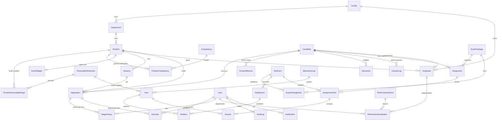

# Veri Modeli ve ER Diyagramı

Şema: [prisma/schema.prisma](../prisma/schema.prisma) — SQLite (demo) ve PostgreSQL (üretim) uyumlu; enum yerine String + TS sabitleri, JSON içerikler String kolonlarda (`src/lib/json.ts`).

## ER Diyagramı (ana ilişkiler)

## Kritik tasarım kararları

1. **Madde (Item) testten bağımsızdır** — PİK analizinde aynı maddenin 6+ formda kullanıldığı görüldü; `TestItem(sectionId, itemId, order)` ilişki tablosuyla bir madde birden çok formda, farklı sırada yer alır.
2. **Bölüm (TestSection) düzeyinde kurallar** — süre, atlama izni (`allowSkip`), yönerge. ÇKE 3 bölümlü ve atlanamaz; yetenek tek bölümlü ve serbest.
3. **Pozisyon profili = baraj + norm + boyut seti + kişilik aralıkları** — PİK "Pozisyon Detayı" ekranının modeli. `abilityDims` JSON dizisiyle Mekanik Kavrama pozisyon bazında açılıp kapanır (v2 revizyon kararı).
4. **AssignmentTest.resultJson** — boyut kırılımları, GEÇTİ/KALDI, uyum yüzdesi ve uyumu düşüren boyutlar hesaplandığı anda serileştirilir; raporlar yeniden hesap gerektirmez.
5. **`sectionDeadline` sunucuda tutulur** — istemci yalnızca geri sayımı gösterir; kesinti telafisi (`+dk`) ve sayfa yenileme bu alan üzerinden güvenle çalışır. Doğru cevap anahtarları istemciye hiçbir zaman gönderilmez.
6. **ConsentRecord** başvuru ve sınav rızalarını metin sürümüyle ayrı ayrı saklar (KVKK ispat yükü).
7. **AuditLog** tüm kritik işlemleri (giriş, aşama taşıma, sıfırlama, dışa aktarım, puanlama) aktör tipiyle kaydeder.
